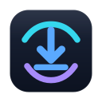
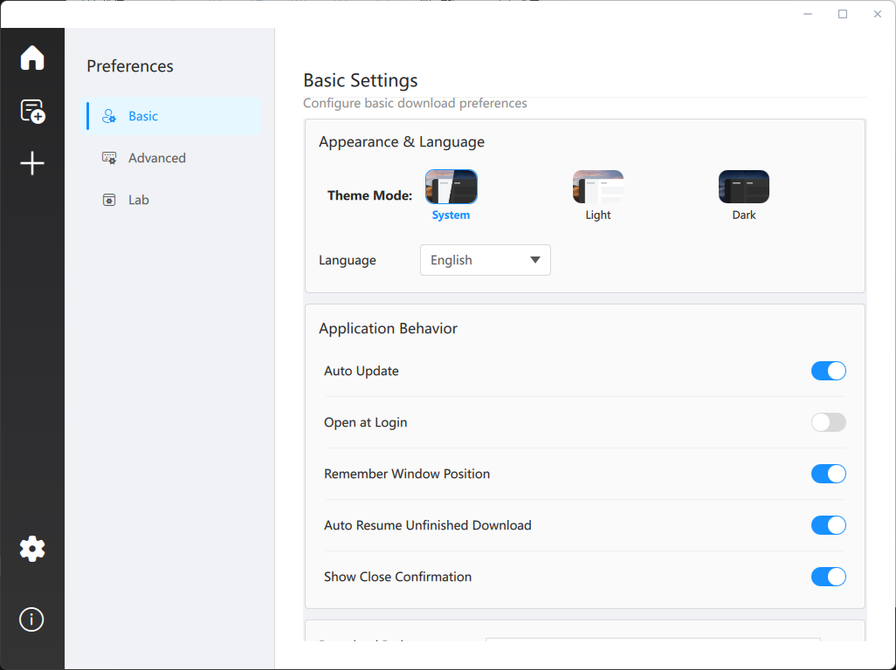
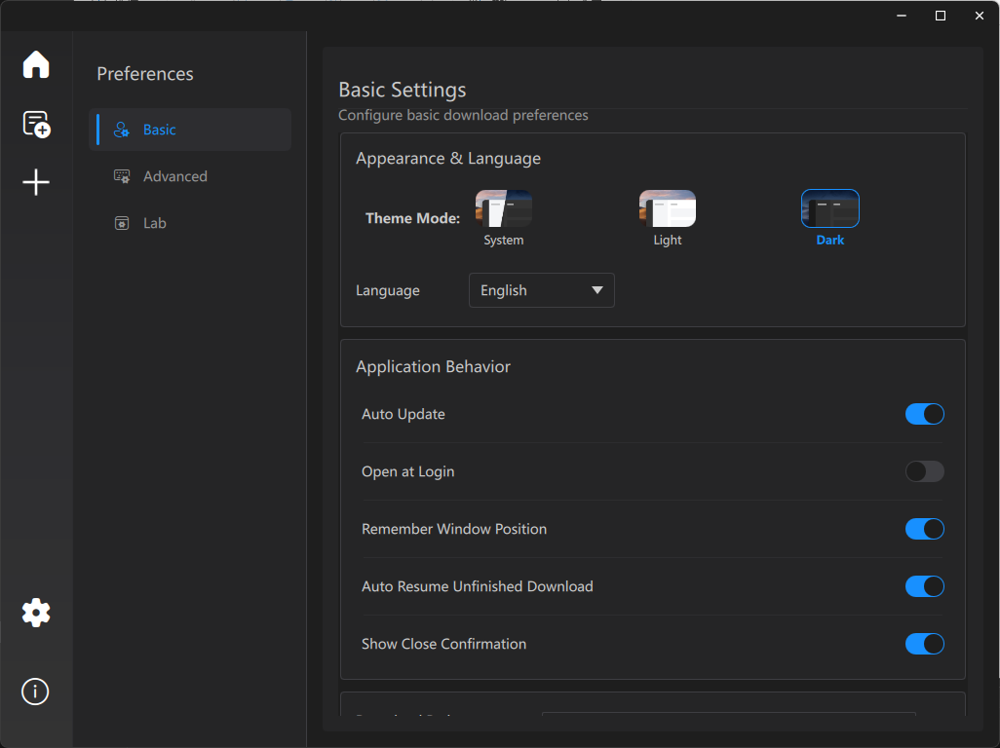

# GDownload

<p align="center">
  
</p>

<p align="center">
  <a href="LICENSE"></a>
  <a href="#"></a>
  <a href="#"></a>
  <a href="#"></a>
</p>

<p align="center">
  <a href="https://github.com/cool2528/GDownload/stargazers">
    
  </a>
  <a href="https://github.com/cool2528/GDownload/network/members">
    
  </a>
</p>

English | [简体中文](README.md)

GDownload is a modern cross-platform download manager built with C++ and Qt. It combines a modern technology stack with excellent open-source components to provide users with an efficient and stable downloading experience.

## 📸 Screenshots

<p align="center">
  
  
</p>
<p align="center"><i>Light Theme & Dark Theme</i></p>

## ✨ Key Features

### 🚀 Powerful Download Engine
- ⚡ High-performance download engine powered by aria2c
- 🔄 Support for multiple protocols (HTTP/HTTPS/FTP/BitTorrent/Metalink)
- 🚄 Multi-threaded concurrent downloads for maximum bandwidth utilization
- 📱 Resume capability - pause and resume anytime
- 🔗 Magnet links and torrent file support

### 🎨 Modern Interface
- 🖥️ Cross-platform support (Windows, macOS, Linux)
- 🌓 Automatic light/dark theme switching
- 🎯 Element Plus design system
- 🌍 Multi-language support (Simplified Chinese, Traditional Chinese, English, 日本語, 한국어)
- 💫 Smooth animations and interactions

### ⚙️ Advanced Features

#### Speed Control
- 📊 Global download speed limit
- 📈 Global upload speed limit (BT/torrents)
- 🎚️ Real-time speed adjustment

#### Connection & Performance Optimization
- 🔌 Maximum connections per server configuration
- 🔢 Minimum segment size settings
- 🧩 File segment count control
- 📦 Disk cache size optimization
- 🔄 Maximum concurrent downloads

#### BitTorrent Enhancements
- 🌐 Automatic BT Tracker server synchronization
- 📡 Custom Tracker sources
- ⏱️ DHT timeout configuration
- 🔁 Automatic retry on timeout

#### Post-Download Actions
- 🔔 System notifications
- 🎵 Custom notification sounds
- 🔊 Voice announcements
- 📂 Auto-open download folder
- 💻 Run custom commands
- 🔌 Auto shutdown/hibernate/sleep

### 🗂️ Cloud Storage Integration
- 📦 Baidu Netdisk shared link parsing and downloading
  - ⚠️ Standard speed only (non-accelerated downloads)
  - 💡 For high-speed downloads, subscribe to Baidu Netdisk official SVIP
- 🔌 Plugin architecture for easy extension to other cloud storage services

### 🧩 Browser Extension (Experimental)

> 💡 **Boost Download Efficiency**: Capture download links directly from your browser, no copy-paste needed

#### Supported Browsers
- 🌐 **Chrome** / **Edge** / **Firefox**

#### Key Features
- 🔗 **One-Click Capture**: Automatically detect download links on web pages
- 📋 **Batch Download**: Select multiple links and send them all at once to GDownload
- 🎨 **Unified Design**: Perfectly matches GDownload's Element Plus interface style
- 🔒 **Secure Connection**: Direct WebSocket connection to aria2c via JSON-RPC
- 🎯 **Smart Filtering**: Filter links by file size, type, and custom rules
- ⚡ **Works Out-of-the-Box**: Pre-configured with optimal settings

#### Quick Installation

**Step 1: Download Extension**
- Visit the extension repository: [gd-browser-extension](https://github.com/cool2528/gd-browser-extension/releases)
- Or use in-app guide: `Settings` → `Lab` → `Browser Extension`

**Step 2: Install in Browser**

<details>
<summary>Chrome / Edge Installation</summary>

1. Open extension management page:
   - Chrome: `chrome://extensions/`
   - Edge: `edge://extensions/`
2. Enable **"Developer mode"** toggle in the top right
3. Click **"Load unpacked"**
4. Select the extracted `dist` folder
</details>

<details>
<summary>Firefox Installation</summary>

1. Open `about:debugging#/runtime/this-firefox`
2. Click **"Load Temporary Add-on"**
3. Select `manifest.json` from the `dist` folder
</details>

**Step 3: Start Using**
- ✅ Extension automatically connects to GDownload
- ✅ Click the extension icon while browsing to capture download links
- ✅ Select links and send them to GDownload with one click

> 📖 **Full Documentation**: Go to `Settings` → `Lab` in the app for complete installation guide and configuration details

## 🛠️ Technology Stack

- 🎯 **UI Framework**: Qt Quick (QML) + Qt C++
- ⚙️ **Core Engine**: aria2c
- 🌐 **Network Library**: Boost.Asio + Beast (WebSocket)
- 🔗 **BT Download**: LibtorrentRasterbar
- 💾 **Data Storage**: SQLite3
- 📝 **Logging**: spdlog
- 📄 **Data Parsing**: nlohmann-json, PugiXML
- 🪟 **Frameless Window**: FramelessHelper
- 🏗️ **Build System**: CMake + vcpkg

## 📦 Installation

[Releases](https://github.com/cool2528/GDownload/releases) Page to download the latest version

### macOS Troubleshooting

If you encounter "App is damaged" or "Cannot open application" warnings on macOS, this is due to security restrictions for applications without developer signatures. You can resolve this by:

1. Open "System Preferences" > "Security & Privacy" > "General", and click "Open Anyway" button (if shown)
2. If the above method doesn't work, open Terminal and enter the following command:
   ```
   sudo xattr -r -d com.apple.quarantine /Applications/GDownload.app
   ```
   Note: Please replace the path with your actual installation location

3. Enter your administrator password, then try opening the application again

## 🚀 Quick Start

1. Download the installer for your system from [Releases](https://github.com/cool2528/GDownload/releases)
2. Launch GDownload
3. Add a download task:
   - Click the ➕ button or use the shortcut `Ctrl+N`
   - Enter the download link (supports HTTP/HTTPS/FTP/magnet links/torrent files)
   - Choose the save location
   - Configure download options (optional)
4. Click "Start Download"
5. Customize your download experience in Settings

### 💡 Tips & Tricks

- **Batch Downloads**: In the new task dialog, enter one link per line
- **Clipboard Monitoring**: When enabled, automatically captures copied download links
- **🔥 Browser Extension**: Go to `Settings` → `Lab` to install the browser extension for a more convenient download experience
  - No need to copy links, capture directly from web pages
  - Batch selection and smart filtering
  - One-click send to GDownload
- **Custom User-Agent**: Configure HTTP request headers in Advanced Settings to bypass download restrictions on some websites
- **BT Acceleration**: Add and update Tracker server lists in Settings to boost BitTorrent download speeds

## 🤝 Contributing

Contributions are welcome! Feel free to submit a Pull Request or create an Issue.

## 📄 License

GDownload is licensed under the [Apache License 2.0](LICENSE.txt).

### Third-Party Components

This project uses several excellent open-source components, including:

- Qt Framework (LGPL v3)
- FramelessHelper (MIT)
- Boost Libraries (Boost Software License)
- LibtorrentRasterbar (BSD)
- PugiXML (MIT)

For detailed third-party component information and license notices, please check the [NOTICE](NOTICE) file.

## 🌟 Acknowledgements

Thanks to all developers and users who have contributed to this project!

## 📱 Contact Us

- [GitHub](https://github.com/cool2528/GDownload)
- [Issue Tracking](https://github.com/cool2528/GDownload/issues)

## ⚠️ Disclaimer

GDownload is provided solely as a download tool for users to legally download Internet resources. Please comply with local laws and regulations when using this software.

- This software does not collect any user privacy information
- The copyright of all resources downloaded by users belongs to the original author or their legal holders
- The developers are not responsible for the content downloaded by users, nor for any losses or damages that may result from using this software
- The Baidu Netdisk shared link parsing function is only intended for legally accessing your own files and should not be used to infringe on others' intellectual property rights
- If any function violates relevant laws and regulations, please contact us promptly through Issues, and we will address it immediately

By using this software, you acknowledge that you have read and agreed to all terms of this disclaimer.